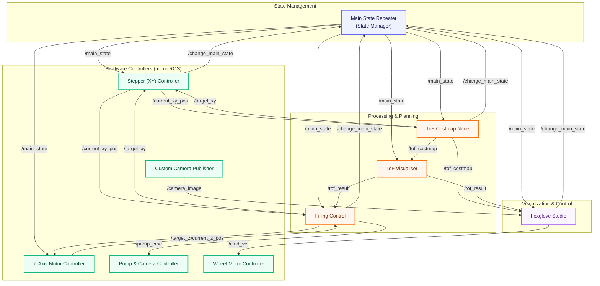
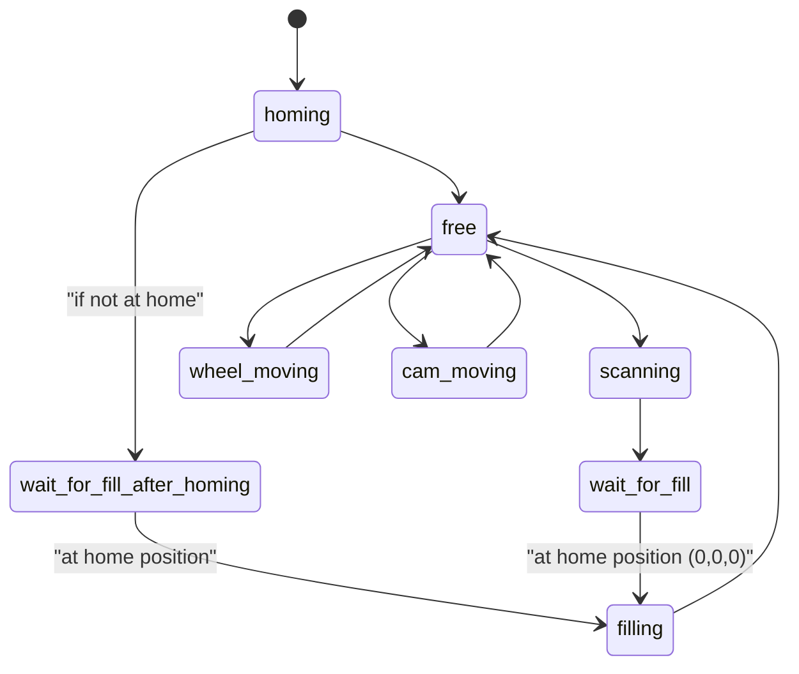

# Road Surface Repair Machine (RSRM)
Engineering Innovation and Design (EID) Project

An autonomous robotic system designed to scan and repair road surface defects (potholes). It uses ROS2 (Jazzy) for coordination and micro-ROS for real-time hardware control.

---

## Team Members
* **Software & Electronics Team:** Ming Jie, Jin Hern, Tze Nin, Zi Jun
* **Mechanical Team:** Sean, Pei Wen, Yan Sheng, Jack, Joel

---

## Repository Structure

* [Software/](file:///c:/Users/mingj/Downloads/Road_Surface_Repair_Machine/Software) - ROS2 packages, micro-ROS configurations, and MCU firmware
  * [ros2_jazzy/](file:///c:/Users/mingj/Downloads/Road_Surface_Repair_Machine/Software/ros2_jazzy) - Main ROS2 Workspace containing packages for state management, visualisers, costmaps, and hardware nodes.
* [Mechanical/](file:///c:/Users/mingj/Downloads/Road_Surface_Repair_Machine/Mechanical) - Mechanical design files, simulations, and documentation.


## System Architecture

### Software Components



### State Machine



* **homing:** Robot homing all axes to origin.
* **free:** Ready for next command.
* **scanning:** Scanning surface with ToF sensors.
* **wait_for_fill:** Waiting after scanning before starting the filling sequence.
* **wait_for_fill_after_homing:** Special state after homing completes if not at home.
* **filling:** Executing automated hole filling sequence.
* **wheel_moving:** Platform repositioning using wheels.
* **cam_moving:** Camera adjustment.

---

## Hardware Components

### Microcontroller Units (ESP32)
1. **Stepper Controller** (`/dev/esp_stepper`)
   - Controls XY scanning stage.
   - Drivers: A4988 for X and Y axes.
   - Endstops installed for homing.
2. **Z-Axis Motor** (`/dev/esp_zaxis`)
   - Controls Z-axis height adjustment for pump positioning.
   - Driver: A4988.
3. **Pump & Camera Controller** (`/dev/esp_cam`)
   - PWM control for the pump.
   - TB6612FNG motor driver for camera adjustment (bidirectional control).
4. **Wheel Motor** (`/dev/esp_wheel`)
   - Platform navigation and repositioning.
   - Velocity control via `/cmd_vel`.

### Sensors
* **ToF (Time-of-Flight):** Distances published via `tof_publisher` node.
* **Camera:** Custom camera node providing visual feedback.

---

## Installation & Setup

### Prerequisites

```bash
# Ubuntu 22.04 + ROS2 Jazzy
sudo apt update && sudo apt upgrade

# Install ROS2 Jazzy (if not already installed)
curl -sSL https://raw.githubusercontent.com/ros/rosdistro/master/ros.key -o /usr/share/keyrings/ros-archive-keyring.gpg
echo "deb [arch=$(dpkg --print-architecture) signed-by=/usr/share/keyrings/ros-archive-keyring.gpg] http://packages.ros.org/ros2/ubuntu $(. /etc/os-release && echo $UBUNTU_CODENAME) main" | sudo tee /etc/apt/sources.list.d/ros2.list > /dev/null
sudo apt update && sudo apt install -y ros-jazzy-desktop python3-colcon-common-extensions
```

### 1. Build Foxglove & Dependencies
Clone required packages into your ROS2 workspace and compile:

```bash
cd ~/Road_Surface_Repair_Machine/Software/ros2_jazzy/src
git clone https://github.com/facontidavide/rosx_introspection.git
git clone https://github.com/foxglove/foxglove-sdk.git

cd ~/Road_Surface_Repair_Machine/Software/ros2_jazzy
rosdep install --from-paths src --ignore-src --rosdistro jazzy -y
colcon build --packages-up-to foxglove_bridge --symlink-install --cmake-args -DCMAKE_BUILD_TYPE=Release
```

### 2. Camera Setup (vision_opencv)
```bash
cd ~/Road_Surface_Repair_Machine/Software/ros2_jazzy/src
git clone -b rolling https://github.com/ros-perception/vision_opencv.git

cd ~/Road_Surface_Repair_Machine/Software/ros2_jazzy
sudo apt update
rosdep update
rosdep install --from-paths src --ignore-src -r -y
colcon build --packages-select cv_bridge
```

### 3. micro-ROS Setup
Set up the micro-ROS agent workspace:

```bash
mkdir -p ~/Road_Surface_Repair_Machine/Software/microros_ws/src
cd ~/Road_Surface_Repair_Machine/Software/microros_ws
git clone -b jazzy https://github.com/micro-ROS/micro_ros_setup.git src/micro_ros_setup

sudo apt update
rosdep update
rosdep install --from-paths src --ignore-src -y
colcon build
source install/local_setup.bash
```

### 4. Serial Device Setup (udev rules)
To ensure consistent naming of microcontroller interfaces, add udev rules:

```bash
# Add current user to dialout group (one-time setup)
sudo usermod -a -G dialout $USER

# Create USB device aliases
sudo nano /etc/udev/rules.d/99-rsrm-usb.rules

# Add the following lines replacing vendor/product IDs:
# SUBSYSTEM=="tty", ATTRS{idVendor}=="XXXX", ATTRS{idProduct}=="YYYY", SYMLINK+="esp_stepper"
# SUBSYSTEM=="tty", ATTRS{idVendor}=="XXXX", ATTRS{idProduct}=="ZZZZ", SYMLINK+="esp_zaxis"
# SUBSYSTEM=="tty", ATTRS{idVendor}=="XXXX", ATTRS{idProduct}=="AAAA", SYMLINK+="esp_cam"
# SUBSYSTEM=="tty", ATTRS{idVendor}=="XXXX", ATTRS{idProduct}=="BBBB", SYMLINK+="esp_wheel"

sudo udevadm control --reload-rules && sudo udevadm trigger
```

### 5. Build Workspace
Build the core RSRM packages:

```bash
cd ~/Road_Surface_Repair_Machine/Software/ros2_jazzy
rm -rf build install log && colcon clean all
colcon build --symlink-install
source install/setup.bash
```

---

## Running the System

### Quick Start: All Systems
Launch the complete RSRM system:

```bash
# Terminal 1: Start micro-ROS Agent
source /opt/ros/jazzy/setup.bash
source ~/Road_Surface_Repair_Machine/Software/microros_ws/install/local_setup.bash
# For a single stepper device:
ros2 run micro_ros_agent micro_ros_agent serial --dev /dev/esp_stepper
# For multiple microcontroller devices:
ros2 run micro_ros_agent micro_ros_agent multiserial --devs /dev/esp_stepper /dev/esp_cam /dev/esp_wheel /dev/esp_zaxis

# Terminal 2: Start Foxglove Bridge
source /opt/ros/jazzy/setup.bash
ros2 launch foxglove_bridge foxglove_bridge_launch.xml port:=8765

# Terminal 3: Launch core robot nodes
source ~/Road_Surface_Repair_Machine/Software/ros2_jazzy/install/setup.bash
ros2 launch rsrm_bringup robot_start.launch.py
```

---

### Individual System Testing

#### 1. Homing All Axes
```bash
ros2 topic pub /change_main_state std_msgs/String "data: homing"
# Verify coordinates set to zero: /current_xy_pos (0,0) and /current_z_pos (0.0)
```

#### 2. Scanning Operation
```bash
# Ensure system is homed first
ros2 topic pub /change_main_state std_msgs/String "data: homing"
sleep 5

# Trigger scanning
ros2 topic pub /change_main_state std_msgs/String "data: scanning"
# Wait for scan to complete and inspect /tof_result
```

#### 3. Filling Operation
```bash
# Requires scanning to have completed successfully
ros2 topic pub /change_main_state std_msgs/String "data: homing"
sleep 5
ros2 topic pub /change_main_state std_msgs/String "data: scanning"
sleep 15
ros2 topic pub /change_main_state std_msgs/String "data: wait_for_fill"
sleep 1
ros2 topic pub /change_main_state std_msgs/String "data: filling"
```

#### 4. Manual Motor & Device Control
Use these commands to publish manually:

```bash
# Move XY stepper
ros2 topic pub /target_xy geometry_msgs/Point "{x: 100, y: 50, z: 0}"

# Move Z axis
ros2 topic pub /target_z std_msgs/Float32 "data: 15.0"

# Control pump (pump for 3000ms)
ros2 topic pub /pump_cmd std_msgs/Int32 "data: 3000"

# Control camera movement
ros2 topic pub /cam_control std_msgs/String "data: up"

# Move wheels
ros2 topic pub /cmd_vel geometry_msgs/Twist "{linear: {x: 0.5, y: 0.0, z: 0.0}, angular: {x: 0.0, y: 0.0, z: 0.0}}"

# Run scan trigger node
ros2 run scan_trigger scan_trigger_node
```

---

## ROS2 Topics Reference

### Publishers (System → User)

| Topic | Type | Description |
|-------|------|-------------|
| `/main_state` | `std_msgs/String` | Current machine state (homing, free, scanning, etc.) |
| `/warning` | `std_msgs/String` | Warning/error messages with timestamps |
| `/current_xy_pos` | `geometry_msgs/PointStamped` | Current XY position (steps) |
| `/current_z_pos` | `std_msgs/Float32` | Current Z position (meters) |
| `/current_pos` | `geometry_msgs/PointStamped` | Combined position with timestamp |
| `/tof_costmap` | `Custom Message` | Raw ToF data with XY coordinates |
| `/tof_result` | `Custom Message` | Detected holes (centroid, volume, depth) |
| `/xy_status` | `std_msgs/String` | Stepper system status |
| `/xy_minmax` | `std_msgs/String` | XY axis limits |

### Subscribers (User → System)

| Topic | Type | Description |
|-------|------|-------------|
| `/change_main_state` | `std_msgs/String` | Request state change |
| `/target_xy` | `geometry_msgs/Point` | Target XY position |
| `/target_z` | `std_msgs/Float32` | Target Z position |
| `/pump_cmd` | `std_msgs/Int32` | Pump duration (ms), 0 to stop |
| `/cam_control` | `std_msgs/String` | Camera command ("up"/"down") |
| `/cmd_vel` | `geometry_msgs/Twist` | Wheel velocity command |

---

## State Transition Rules

| From State | To State | Condition / Rule |
|------------|----------|------------------|
| Any | `homing` | Always allowed |
| `free` | `scanning` | Allowed |
| `scanning` | `wait_for_fill` | Allowed |
| `wait_for_fill` | `filling` | Must be at home position (0,0,0) |
| `wait_for_fill_after_homing` | `filling` | At home position after homing |
| `free` | `wheel_moving` | Allowed |
| `free` | `cam_moving` | Allowed |
| Any non-free | Any other | **DENIED** (warning published) |

---

## Troubleshooting & Verification Tests

### Microcontroller Direct Serial Test
If a stepper or microcontroller is not responding to ROS2 messages, test direct connectivity using Python:
```bash
python3 -c "import serial; s = serial.Serial('/dev/esp_stepper', 115200); s.write(b'S'); print('sent')"
```

### Common Issues
* **Micro-ROS agents not connecting:** Check `ls /dev/tty*` and udev permissions (ensure user is in `dialout` group).
* **State transitions rejected:** Monitor `ros2 topic echo /warning` to read transition error reasons.
* **Motors not responding:** Confirm the micro-ROS agent is active (`ros2 node list` should display nodes like `/xy_stepper_node`).

---

## Safety Features
* **State Lock:** Only one operational state can be active at a time to prevent conflicting motion commands.
* **Position Validation:** Verifies hardware homing before proceeding to critical automated tasks.
* **Timeout Protection:** Actuators automatically stop if continuous signals/commands are lost.
* **Emergency Stop:** Transitioning to `free` is allowed from any active state.
